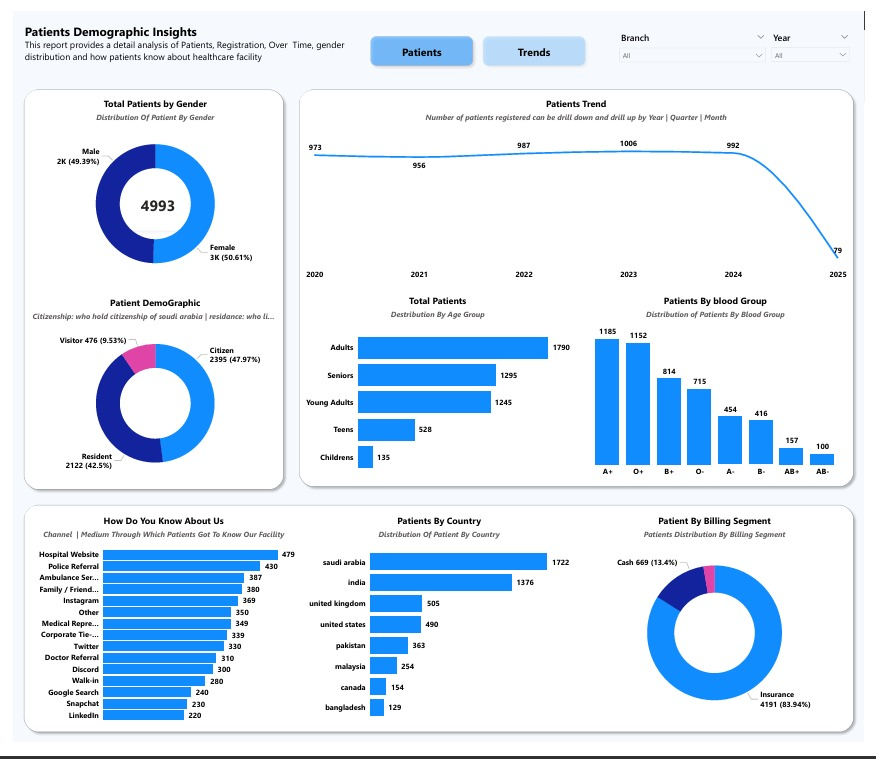
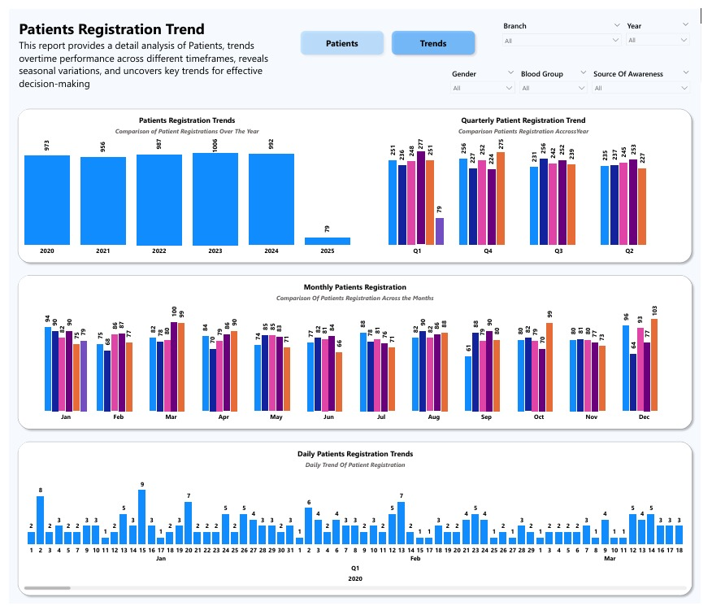
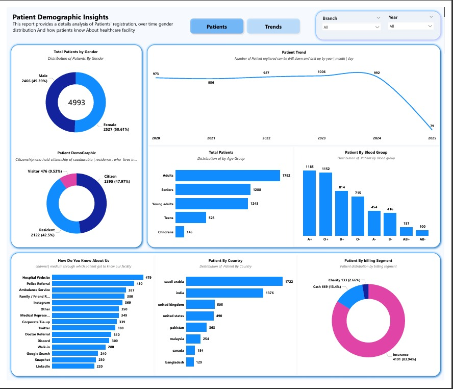
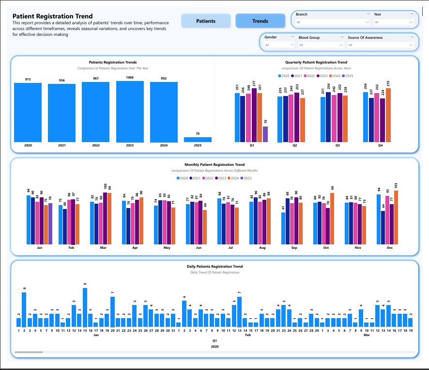

# Hospital Patient Demographics Dashboard

## Project Overview

This Power BI dashboard provides comprehensive insights into patient demographics across hospital branches. Data was extracted from SQL Server, transformed using Power Query, and analyzed using DAX measures to create meaningful healthcare insights and interactive visualizations.

## Data Source

* SQL Server Database
* Healthcare Patient Records Dataset

## Tools & Technologies Used

* Power BI
* SQL Server
* Power Query
* DAX
* Data Modeling
* Microsoft Excel

## Key KPIs

* Total Patients
* Male Patients
* Female Patients
* Gender Distribution %
* Age Group Analysis
* Branch-wise Patient Distribution

## Skills Demonstrated

* SQL Data Extraction
* ETL using Power Query
* Data Modeling
* DAX Measures & Calculations
* KPI Development
* Interactive Dashboard Design
* Healthcare Analytics
* Data Visualization

## Dashboard Versions

### Version 1 – With Borders

A structured dashboard design with bordered visual containers.

### Version 2 – Without Borders

A modern and clean dashboard design focused on readability and user experience.

## Project Files

* Patient-Demographic-Dashboard-With-Border.pbix
* Patient-Demographic-Dashboard-Without-Border.pbix

## Dashboard Screenshots

### Patient Overview (Without Borders)

### Patient Trends (Without Borders)

### Patient Overview (With Borders)

### Patient Trends (With Borders)

## Author

**Shaik Afroz**

Power BI Developer | Data Analyst
